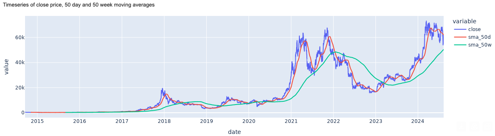
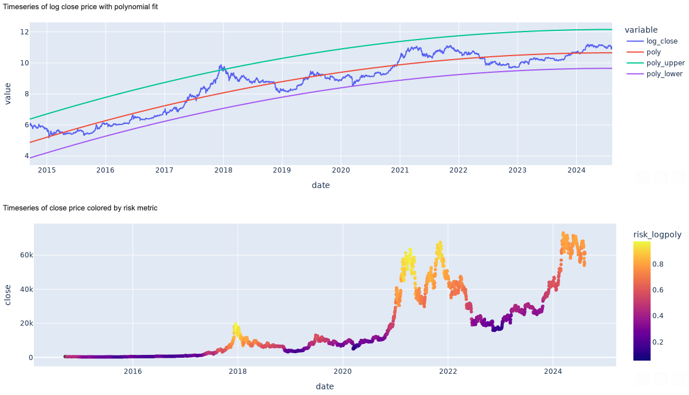

# markets

An application that emails daily market analysis (asset risk metrics) with visualisaions
to my personal email.

The applicaiton is deployed on AWS using infrastructure as code (Terraform). The app is
containerised with docker and deploy in lambda which is invoked on a daily schedule
using AWS eventbridge.

The app itself reads in data from yahoo finance, procsesses the data using pandas and
send the analysis in an email. See below for examples of the output:

